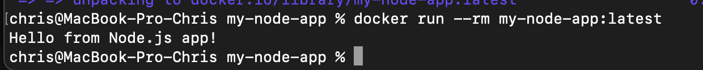

# Node.js CI/CD Pipeline App

Учебный проект для демонстрации настройки процессов непрерывной интеграции (CI) для приложения на **Node.js** с использованием **GitHub Actions** и **Docker**.

## Описание проекта
Проект включает в себя базовое Node.js приложение, покрытое тестами, и автоматизированный конвейер (pipeline). Он автоматически реагирует на добавление нового кода в репозиторий.

## Функционал CI/CD
Пайплайн настроен в файле `.github/workflows/ci.yml` и выполняет следующие шаги:
1. **Установка зависимостей:** Чистая установка пакетов через `npm ci`.
2. **Линтинг кода:** Проверка синтаксиса и стиля с помощью `ESLint`.
3. **Тестирование:** Запуск тестов `Jest` на нескольких версиях Node.js (18, 20, 22).
4. **Сборка Docker-образа:** Проверка успешной упаковки приложения в контейнер при пуше в ветку `main`.

## Запуск локально
Сборка проекта в Docker-образ:
#
docker build -t my-node-app:latest .
#
